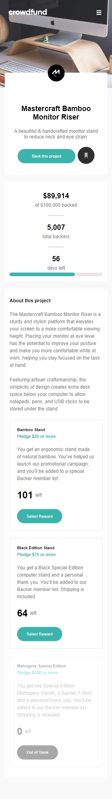
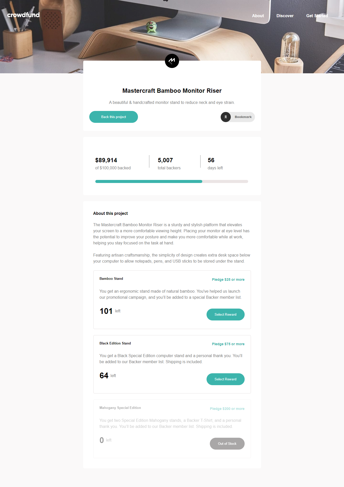

# Frontend Mentor - Crowdfunding product page solution

This is a solution to the [Crowdfunding product page challenge on Frontend Mentor](https://www.frontendmentor.io/challenges/crowdfunding-product-page-7uvcZe7ZR). Frontend Mentor challenges help you improve your coding skills by building realistic projects. 

## Table of contents

- [Overview](#overview)
  - [The challenge](#the-challenge)
  - [Screenshot](#screenshot)
  - [Links](#links)
- [My process](#my-process)
  - [Built with](#built-with)
  - [What I learned](#what-i-learned)
  - [Continued development](#continued-development)
- [Author](#author)


## Overview

### The challenge

Users should be able to:

- View the optimal layout depending on their device's screen size
- See hover states for interactive elements
- Make a selection of which pledge to make
- See an updated progress bar and total money raised based on their pledge total after confirming a pledge
- See the number of total backers increment by one after confirming a pledge
- Toggle whether or not the product is bookmarked

### Screenshot




### Links

- Solution URL: [https://github.com/ibimina/crowdfunding-product-page-main](https://github.com/ibimina/crowfunding-product-page-main)
- Live Site URL: [https://ibimina.github.io/crowdfunding-product-page-main/](https://ibimina.github.io/crowfunding-product-page-main/)

## My process

### Built with

- Semantic HTML5 markup
- CSS custom properties
- Flexbox
- CSS Grid
- Mobile-first workflow


### What I learned
DOM manipulation

This function displays the pledge page and activate the active state of the pledge box

```js
coselectRewardBtn.forEach((element) => {
  // console.log(reward)
  element.addEventListener("click", (e) => {
    e.preventDefault();
   // console.log(element.dataset.action);

   let getRadioButton
    
   radioBtn.forEach(btn => {
       console.log(element.value)
       if (element.dataset.action === btn.value) {
         project();
         getRadioButton = btn;
console.log(getRadioButton)
         getRadioButton.checked = true;

        getRadioButton.scrollIntoView();
         getRadioButton.parentElement.parentElement.parentElement.classList.add(
           "box-bordercolor"
         );
         getRadioButton.parentElement.parentElement.nextElementSibling.classList.add(
           "block"
         );
       } 
       else if(element.dataset.action !== btn.value) {
        console.log("pass")
        console.log(btn);
        btn.parentElement.parentElement.parentElement.classList.remove(  "box-bordercolor" );
        btn.parentElement.parentElement.nextElementSibling.classList.remove( "block");
       }
    });nst selectRewardBtn = document.querySelectorAll(".select");
 })
  })

```


### Continued development
DOM Manipulation


## Author


- Frontend Mentor - [@ibimina](https://www.frontendmentor.io/profile/ibimina)
- Twitter - [@ibiminaaH](https://www.twitter.com/ibiminaaH)


